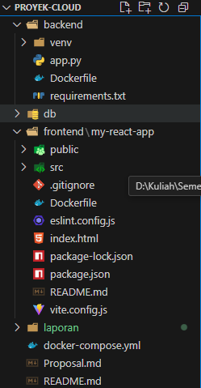

# Laporan Proyek Week 10 : Kelompok 3
1. Rahmatullah - 10221027
2. Zidane Alfarizi - 10221034
3. Muhammad Daffa Rayhan - 10221058

## 1. Struktur Code Program



## 2. Skema Database dan Struktur Tabel

Proyek ini menggunakan **PostgreSQL** sebagai basis data untuk menyimpan data reservasi dan ulasan. Berikut adalah skema database yang digunakan:

```sql
CREATE TABLE IF NOT EXISTS tables (
    id SERIAL PRIMARY KEY,
    table_number INT NOT NULL,
    status VARCHAR(20) DEFAULT 'available'
);

CREATE TABLE IF NOT EXISTS reservations (
    id SERIAL PRIMARY KEY,
    name VARCHAR(100) NOT NULL,
    time TIMESTAMP NOT NULL,
    table_number INT NOT NULL,
    status VARCHAR(20) DEFAULT 'reserved',
    FOREIGN KEY (table_number) REFERENCES tables(id)
);

CREATE TABLE IF NOT EXISTS reviews (
    id SERIAL PRIMARY KEY,
    user_name VARCHAR(100) NOT NULL,
    review_text TEXT NOT NULL,
    rating INT NOT NULL CHECK (rating >= 1 AND rating <= 5),
    created_at TIMESTAMP DEFAULT CURRENT_TIMESTAMP
);
```

### Penjelasan Struktur Tabel:
1. **Tabel `tables`**: Menyimpan informasi mengenai meja di restoran, seperti nomor meja dan status ketersediaan.
2. **Tabel `reservations`**: Menyimpan data tentang reservasi, termasuk nama pemesan, waktu pemesanan, nomor meja, dan status reservasi.
3. **Tabel `reviews`**: Menyimpan data ulasan dari pelanggan, yang mencakup nama pengguna, teks ulasan, rating yang diberikan (antara 1 hingga 5), dan waktu pembuatan ulasan.

## 3. Backend Flask (API Endpoints)

Backend menggunakan **Flask** untuk menyediakan REST API yang memungkinkan frontend untuk berkomunikasi dengan database dan melakukan operasi CRUD (Create, Read, Update, Delete) pada data reservasi dan ulasan.

### a. API Reservasi

1. **POST /api/reservations**: Endpoint ini digunakan untuk membuat reservasi baru.
   - Request Body:
     ```json
     {
       "name": "John Doe",
       "time": "2025-04-21T19:00:00",
       "table_number": 1
     }
     ```
   - Response:
     ```json
     {
       "id": 1,
       "name": "John Doe",
       "time": "2025-04-21T19:00:00",
       "table_number": 1
     }
     ```

2. **GET /api/reservations**: Endpoint ini digunakan untuk mengambil daftar semua reservasi yang ada.
   - Response:
     ```json
     [
       {
         "id": 1,
         "name": "John Doe",
         "time": "2025-04-21T19:00:00",
         "table_number": 1,
         "status": "reserved"
       }
     ]
     ```

3. **PUT /api/reservations/{id}**: Endpoint ini digunakan untuk memperbarui informasi reservasi yang ada.
   - Request Body (Optional):
     ```json
     {
       "name": "Jane Doe",
       "status": "confirmed"
     }
     ```
   - Response:
     ```json
     {
       "message": "Reservation updated successfully!"
     }
     ```

4. **DELETE /api/reservations/{id}**: Endpoint ini digunakan untuk menghapus reservasi berdasarkan ID.
   - Response:
     ```json
     {
       "message": "Reservation deleted successfully!"
     }
     ```

### b. API Ulasan

1. **POST /api/reviews**: Endpoint ini digunakan untuk menambahkan ulasan baru.
   - Request Body:
     ```json
     {
       "user_name": "John Doe",
       "review_text": "Great food and service!",
       "rating": 5
     }
     ```

2. **GET /api/reviews**: Endpoint ini digunakan untuk mengambil semua ulasan.
   - Response:
     ```json
     [
       {
         "id": 1,
         "user_name": "John Doe",
         "review_text": "Great food and service!",
         "rating": 5,
         "created_at": "2025-04-20T18:00:00"
       }
     ]
     ```

3. **DELETE /api/reviews/{id}**: Endpoint ini digunakan untuk menghapus ulasan berdasarkan ID.
   - Response:
     ```json
     {
       "message": "Review deleted successfully!"
     }
     ```

## 4. Dockerfile untuk Backend

Untuk menjalankan backend dalam container, kami menyiapkan **Dockerfile** sebagai berikut:

```dockerfile
FROM python:3.9-slim
WORKDIR /app
COPY requirements.txt requirements.txt
RUN pip install --no-cache-dir -r requirements.txt
COPY . .
EXPOSE 5000
CMD ["python", "app.py"]
```

## 5. Dokumentasi API

### a. **API Reservasi**
- **POST /api/reservations**
  - Request Body:
    ```json
    {
      "name": "John Doe",
      "time": "2025-04-21T19:00:00",
      "table_number": 1
    }
    ```
  - Response:
    ```json
    {
      "id": 1,
      "name": "John Doe",
      "time": "2025-04-21T19:00:00",
      "table_number": 1
    }
    ```

- **GET /api/reservations**
  - Response:
    ```json
    [
      {
        "id": 1,
        "name": "John Doe",
        "time": "2025-04-21T19:00:00",
        "table_number": 1,
        "status": "reserved"
      }
    ]
    ```

- **PUT /api/reservations/{id}**
  - Request Body (Optional):
    ```json
    {
      "name": "Jane Doe",
      "status": "confirmed"
    }
    ```
  - Response:
    ```json
    {
      "message": "Reservation updated successfully!"
    }
    ```

- **DELETE /api/reservations/{id}**
  - Response:
    ```json
    {
      "message": "Reservation deleted successfully!"
    }
    ```

### b. **API Ulasan**
- **POST /api/reviews**
  - Request Body:
    ```json
    {
      "user_name": "John Doe",
      "review_text": "Great food and service!",
      "rating": 5
    }
    ```

- **GET /api/reviews**
  - Response:
    ```json
    [
      {
        "id": 1,
        "user_name": "John Doe",
        "review_text": "Great food and service!",
        "rating": 5,
        "created_at": "2025-04-20T18:00:00"
      }
    ]
    ```

- **DELETE /api/reviews/{id}**
  - Response:
    ```json
    {
      "message": "Review deleted successfully!"
    }
    ```

## 6. Implementasi Docker dan Docker Compose

Untuk menjalankan aplikasi ini dalam container Docker, kami menggunakan **Docker Compose** yang mengatur backend dan frontend dalam satu file konfigurasi.

```yaml
version: '3.8'
services:
  backend:
    build: ./backend
    ports:
      - "5000:5000"
    environment:
      DB_HOST: db
      DB_NAME: restoran
      DB_USER: mamat
      DB_PASSWORD: 123
  frontend:
    build: ./frontend
    ports:
      - "3000:3000"
    depends_on:
      - backend
  db:
    image: postgres:latest
    environment:
      POSTGRES_DB: restoran
      POSTGRES_USER: mamat
      POSTGRES_PASSWORD: 123
    volumes:
      - pgdata:/var/lib/postgresql/data
volumes:
  pgdata:
```

## 7. Screenshot Implementasi
Berikut adalah screenshot yang menunjukkan proses implementasi dan hasil yang dicapai:


**Gambar**: Tampilan halaman frontend aplikasi dengan formulir reservasi.

<br>


**Gambar**: Tampilan API untuk membuat reservasi menggunakan Postman.
